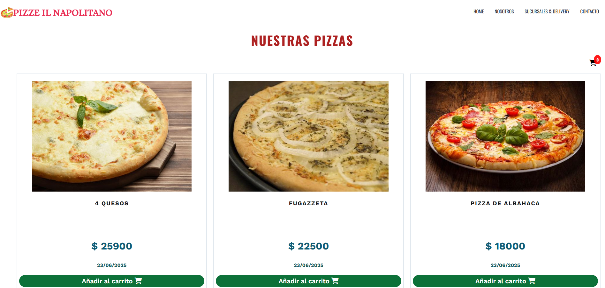
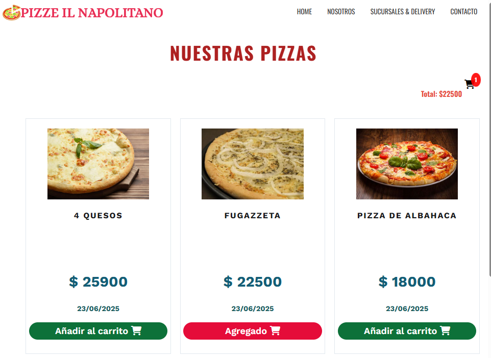
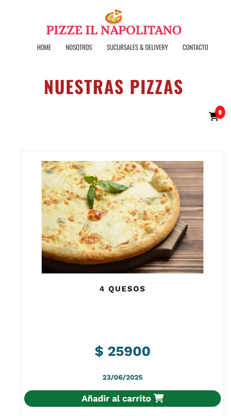

# Proyecto pizzería

Aplicación web que presenta un catálogo de pizzas con funcionalidad de carrito de compras, permitiendo a los usuarios agregar productos y ver el total de su pedido

## Tecnologías utilizadas
- Desarrollado con HTML5/CSS3
- Diseño responsive
- Vanilla javaScript
- Animeate.css para animaciones

## Funcionalidades del carrito

- Agregar productos con un solo clic
- Prevención de duplicados
- Contador visual de productos
- Cálculo automatico del total
- Indicador visual cuando un producto es agregado

## Screenshots

## Enlaces
-[Web del sitio]https://project-pizzas-front-end.netlify.app/

## Autor

- [@Emilia Corbetta] (https://www.github.com/ememcoru/)

## Licencia

[MIT] (https://choosealicense.com/licenses/mit/)

